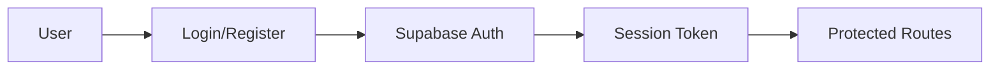
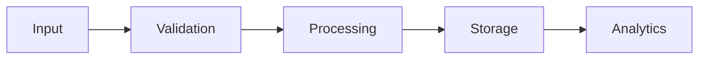
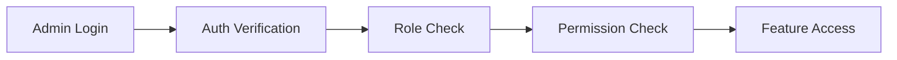

# Carbonly.ai Development Roadmap

This document outlines the development roadmap and AI agent behavior guidelines for the Carbonly.ai platform.

## Core Functionality Phases

### Phase 1: Foundation (Current)
- ✅ Basic authentication and user management
- ✅ Organization and project structure
- ✅ Dashboard layout and navigation
- ✅ Initial emission data management
- ✅ Basic AI assistant integration

### Phase 2: Enhanced Data Processing
- 🚧 AI-powered document scanning improvements
  - PDF parsing optimization
  - Table structure recognition
  - Multi-language support
- 🚧 Automated data categorization
- 🚧 Bulk data import/export
- 🚧 Data validation rules

### Phase 3: Advanced Analytics
- 📊 Enhanced visualization components
- 📈 Predictive emissions modeling
- 🎯 Goal setting and tracking
- 📱 Mobile responsiveness improvements
- 🔄 Real-time data updates

### Phase 4: Admin Panel & SaaS Management
- 👑 Super Admin Dashboard
  - Organization management interface
  - Subscription plan management
  - System-wide analytics
  - Audit logging system
- 💰 Billing System Integration
  - Payment processing
  - Subscription management
  - Usage-based billing
  - Invoice generation
- 🔍 Monitoring & Analytics
  - System health monitoring
  - Usage analytics
  - Performance metrics
  - Error tracking
- 🛡️ Enhanced Security
  - Role-based access control
  - Activity audit trails
  - Security compliance
  - Data encryption

### Phase 5: Integration & Scaling
- 🔌 External API integrations
- 🌐 Multi-region support
- 🔒 Enhanced security features
- 🚀 Performance optimizations

## AI Agent Behavior Guidelines

### 1. Data Flow Understanding

The AI Agent should understand and maintain the following data flows:

#### Authentication Flow


#### Emission Data Flow


### 2. Component Interaction Rules

The AI Agent should maintain these component interaction patterns:

1. **State Management**
   - Use React context for global state
   - Keep component state local when possible
   - Implement proper error boundaries

2. **Data Fetching**
   - Use server components for initial data
   - Implement optimistic updates
   - Handle loading and error states

3. **Form Handling**
   - Validate inputs using Zod schemas
   - Implement proper error messages
   - Maintain form state consistency

### 3. Code Organization Principles

The AI Agent should follow these organization principles:

1. **File Structure**
   - Keep related components together
   - Maintain clear separation of concerns
   - Use proper naming conventions

2. **Component Architecture**
   - Build reusable UI components
   - Implement proper prop typing
   - Follow atomic design principles

3. **API Integration**
   - Use proper error handling
   - Implement request caching
   - Follow RESTful principles

### 4. Performance Considerations

The AI Agent should optimize for:

1. **Frontend Performance**
   - Implement code splitting
   - Optimize image loading
   - Minimize bundle size

2. **Database Efficiency**
   - Use proper indexing
   - Implement query optimization
   - Handle large datasets

3. **API Performance**
   - Implement rate limiting
   - Use proper caching
   - Handle concurrent requests

### 5. Security Guidelines

The AI Agent should maintain:

1. **Authentication**
   - Proper session management
   - Secure password handling
   - Multi-factor authentication support

2. **Authorization**
   - Role-based access control
   - Resource-level permissions
   - API endpoint protection

3. **Data Protection**
   - Input sanitization
   - XSS prevention
   - CSRF protection

## Admin Panel Development Guidelines

### 1. Access Control Flow



### 2. Component Architecture

The admin panel follows a modular architecture:

1. **Layout Components**
   - AdminLayout
   - AdminHeader
   - AdminSidebar
   - AdminFooter

2. **Feature Components**
   - OrganizationManager
   - SubscriptionManager
   - SystemSettings
   - AuditLogs
   - Analytics

3. **Shared Components**
   - DataGrid
   - FilterPanel
   - ActionMenu
   - StatusBadge

### 3. State Management

Admin panel state management guidelines:

1. **Global State**
   - System settings
   - Feature flags
   - User preferences
   - Notifications

2. **Local State**
   - Form data
   - UI interactions
   - Temporary data

3. **Cache Management**
   - Organization data
   - User sessions
   - Frequently accessed data

### 4. Data Flow Patterns

1. **Organization Management**
   ```mermaid
   graph LR
       A[List Orgs] --> B[View Details]
       B --> C[Modify Settings]
       C --> D[Update DB]
       D --> E[Audit Log]
   ```

2. **Subscription Management**
   ```mermaid
   graph LR
       A[Plan Config] --> B[User Subscribe]
       B --> C[Payment Process]
       C --> D[Update Status]
       D --> E[Notify]
   ```

### 5. Security Guidelines

1. **Authentication**
   - Multi-factor authentication
   - Session management
   - IP whitelisting
   - Access logging

2. **Authorization**
   - Role-based permissions
   - Feature-level access
   - Data access control
   - Action auditing

3. **Data Protection**
   - Sensitive data encryption
   - Audit trail logging
   - Data backup
   - Compliance checks

### 6. Performance Optimization

1. **Data Loading**
   - Pagination
   - Infinite scrolling
   - Data caching
   - Lazy loading

2. **UI Optimization**
   - Component code splitting
   - Virtual scrolling
   - Optimized renders
   - Efficient state updates

### 7. Error Handling

1. **User Errors**
   - Input validation
   - Confirmation dialogs
   - Undo capabilities
   - Error messages

2. **System Errors**
   - Error boundaries
   - Fallback UI
   - Error logging
   - Recovery actions

## Feature Implementation Priorities

1. **High Priority**
   - Critical bug fixes
   - Security improvements
   - Core functionality enhancements

2. **Medium Priority**
   - UI/UX improvements
   - Performance optimizations
   - Additional features

3. **Low Priority**
   - Nice-to-have features
   - Experimental features
   - Documentation updates

## Testing Strategy

The AI Agent should maintain:

1. **Unit Tests**
   - Component testing
   - Utility function testing
   - API endpoint testing

2. **Integration Tests**
   - Flow testing
   - API integration testing
   - Database interaction testing

3. **E2E Tests**
   - User flow testing
   - Cross-browser testing
   - Performance testing

## Documentation Requirements

The AI Agent should maintain:

1. **Code Documentation**
   - Clear comments
   - Type definitions
   - Function documentation

2. **API Documentation**
   - Endpoint documentation
   - Request/response examples
   - Error handling

3. **User Documentation**
   - Feature guides
   - API guides
   - Troubleshooting guides 